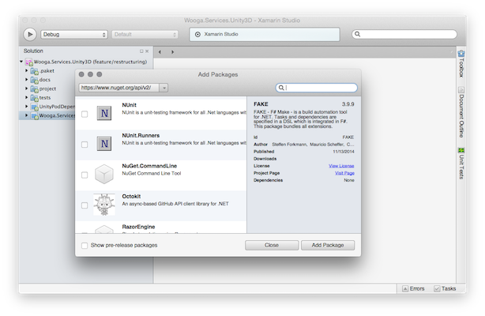
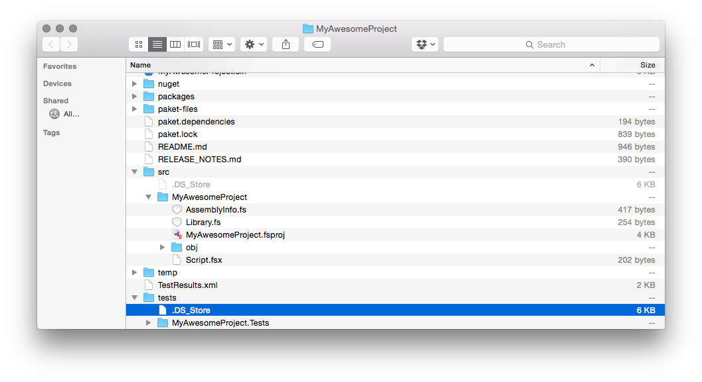
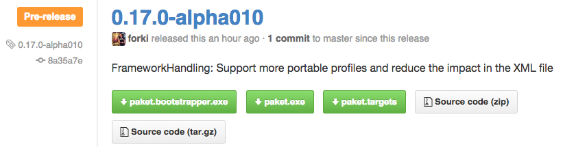
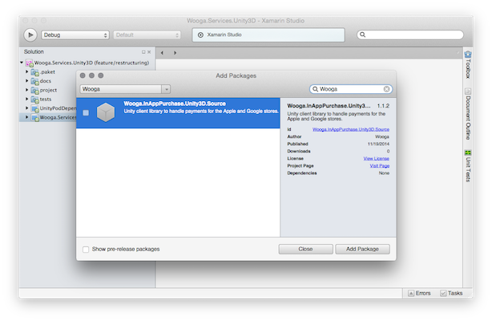
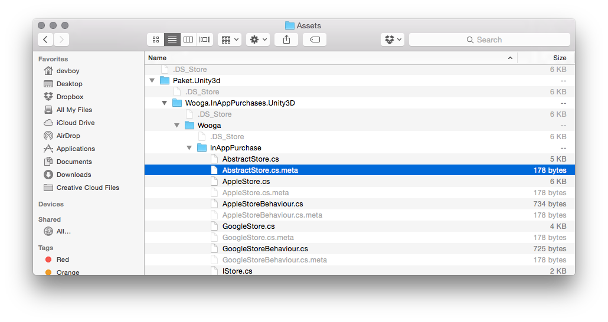

- title : FsReveal
- description : Introduction to FsReveal
- author : Karlkim Suwanmongkol
- theme : night
- transition : slide

***

# Unity3D Tooling

*(may contain traces of F#)*

***

# General Tooling

---

#### Building
#### Testing
#### Documenting
#### Releasing
#### Dependency Management

***

# Unity3D

---

### Expectations

---

### Reality

---

### Editor All The Things

---

### UnityPods

---

### Difficult To Automate

***

# .NET

---

### Going In

---

### Well Actually It's Cool

---

### NuGet

https://www.nuget.org/

---

### But Most Is IDE based

***

### F# All The Things

***

### Paket
Dependency Manager on top of NuGet

http://fsprojects.github.io/Paket/

---

### Paket Dependencies

paket.dependencies (in Project root)

    source https://nuget.org/api/v2

    nuget Castle.Windsor-log4net ~> 3.2
    nuget NUnit

paket.references (next to .csproj)

    Castle.Windsor-log4net
    NUnit

---

### Paket Usage

installing dependencies

    [lang=bash]
    $ [mono] paket.exe update
    $ [mono] paket.exe install
    $ [mono] paket.exe outdated

***

### FAKE
F# Make - A DSL for build tasks

http://fsharp.github.io/FAKE/

---

### FAKE - Build

    Target "Build" (fun _ ->
      !! solutionFile
      |> MSBuildRelease "" "Rebuild"
      |> ignore
      )

---

### FAKE - Test

    Target "NUnitTest" (fun _ ->
      testDlls
      |> NUnit (fun p ->
        {p with
          DisableShadowCopy = true;
          OutputFile = testDir + "TestResults.xml"})
          )

---

### FAKE - Release

    Target "Release" (fun _ ->
      StageAll ""
      Git.Commit.Commit "" (sprintf "Bump version to %s" release.NugetVersion)
      Branches.push ""

      Branches.tag "" release.NugetVersion
      Branches.pushTag "" "origin" release.NugetVersion

      // release on github
      createClient user password
      |> createDraft gitOwner gitName release.Version release.Notes
      |> uploadFile "myRelease.zip"
      |> releaseDraft
      |> Async.RunSynchronously
      )

***

### ProjectScaffold
A prototypical .NET solution (file system layout and tooling)

http://fsprojects.github.io/ProjectScaffold/

---

### ProjectScaffold - Outline

* allows a simple [one step release process](release-process.html).
* works with most [build servers](build-servers.html)
* compiles the application and [runs all test projects](running-tests.html)
* generates [SourceLinks](https://github.com/ctaggart/SourceLink)
* generates [API docs based on XML documentation tags](writing-docs.html#API-docs)
* generates [documentation based on Markdown files](writing-docs.html#Markdown-files)
* generates and/or pushes [NuGet](http://www.nuget.org) packages

---

### ProjectScaffold - Usage

    [lang=bash]
    $ git clone https://github.com/fsprojects/ProjectScaffold.git MyAwesomeProject
    $ cd MyAwesomeProject/
    $ sh build.sh
    (...)
    #####################################################

    # Project Scaffold Init Script
    # Please answer a few questions and we will generate

    #####################################################

    Project Name (used for solution/project files): MyAwesomeProject
    Summary (a short description): Some Super Awesome Project
    Description (longer description used by NuGet): Some Really Super Awesome Project
    Author: Me
    Tags (separated by spaces): awesome, super, project
    Github User or Organization: wooga
    Github Project Name (leave blank to use Project Name):

---

### ProjectScaffold - Output
Comes with FAKE and Paket

---

### ProjectScaffold - Release

    [lang=bash]
    $ sh build.sh Release "nugetkey=..." "github-user=..." "github-pw=..."

---

### Awesome Sauce

***

# Back To Unity3D

---

### Why!?? Oh. Why!??

---

### FAKE - Test With Unity3D

    Target "RunTestsOnUnity3D" (fun() ->
      // Copies some files and executes UnityTestTools
    )

---

### FAKE - Build & Upload
Create UnityPod

    Target "BuildUnityPod" (fun() ->
      // Copies some files and executes UnityPods.BuildPackage
    )

Upload UnityPod

    Target "UploadUnityPod" (fun() ->
      // Copies some files and executes UnityPods.UploadPackage
    )

---

### FAKE - Unity3D NuGet Package

    <?xml version="1.0" encoding="utf-8"?>
    <package ...>
      <metadata xmlns="http://schemas.microsoft.com/packaging/2010/07/nuspec.xsd">
        <id>@project@</id>
        <version>@build.number@</version>
        <dependencies />
      </metadata>
      <files>
        <file src="src/Wooga.InAppPurchase.Unity3D/Wooga/**/*.cs"
              target="content/Wooga"
              exclude="src/Wooga.InAppPurchase.Unity3D/UnityPods/**" />
        <file src="resources/Native.Android/**"
              target="content/Plugins/Android" />
        <file src="resources/Native.iOS/**"
               target="content/Plugins/iOS" />
      </files>
    </package>

***

# Dependencies in Unity3D

---

### Private Wooga NuGet

***

### Paket.Unity3D
An extension for the Paket dependency manager that enables the integration of NuGet dependencies into Unity3D projects.

http://devboy.org/Paket.Unity3D/

---

### Paket.Unity3D - Usage

paket.dependencies (in Project root)

    source http://wooga.artifactoryonline.com/wooga/api/nuget/nuget-private
      username: "nuget-consumer" password: "password"

    nuget Wooga.InAppPurchases.Unity3D
    nuget NUnit

paket.unity3d.references (next to Assets directory)

    Wooga.InAppPurchases.Unity3D

---

### Paket.Unity3D - Output

***

### Work In Progrss

*Let's see what brilliant ideas Unity5 comes up with*

***

# Example

---

### We do it live

***
